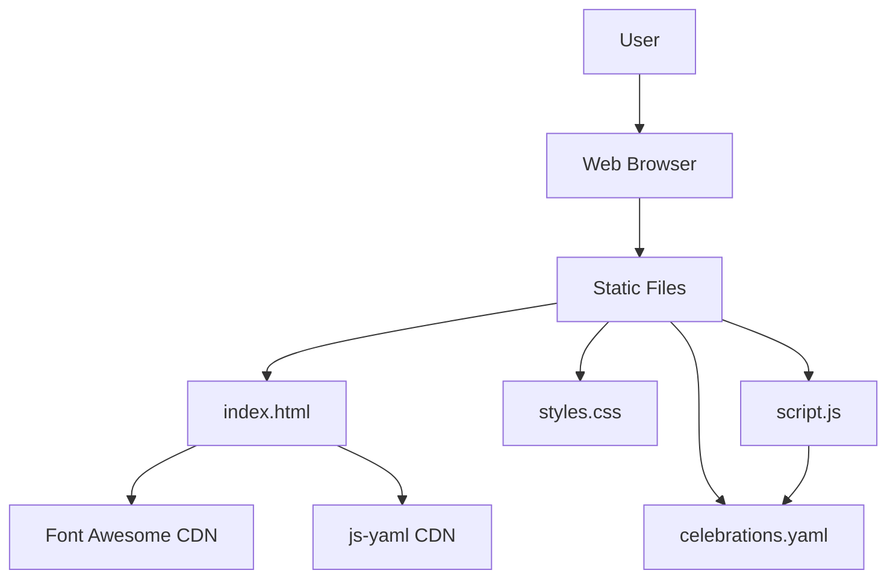

# Web-Celebration

**Web-Celebration** is a responsive web application that displays a calendar of celebrations, including birthdays, namesdays, Valentines, Christmas, and weddings. The calendar is presented as a vertical timeline from January to December, showcasing important dates with corresponding icons. The application automatically updates to show upcoming events in the next year if the current year's event has passed.

## Table of Contents

- [Web-Celebration](#web-celebration)
  - [Table of Contents](#table-of-contents)
  - [Features](#features)
  - [Architecture](#architecture)
  - [Technologies Used](#technologies-used)
  - [Installation](#installation)
    - [Prerequisites](#prerequisites)
    - [Steps](#steps)
  - [Deployment](#deployment)
  - [Usage](#usage)
    - [Adding or Modifying Events](#adding-or-modifying-events)
    - [Date Format](#date-format)
  - [License](#license)


## Features

- **Responsive Design**: Works seamlessly on desktops, tablets, and mobile devices.
- **Vertical Timeline**: Displays events from January to December on a vertical line.
- **Icon Integration**: Each type of event is represented with a relevant Font Awesome icon.
- **Automatic Year Update**: Events that have passed are moved to the next year automatically.
- **YAML Configuration**: Easily manage events through a YAML file.

## Architecture



Technologies Used
-----------------

*   **HTML5 & CSS3**: For structuring and styling the web page.
*   **JavaScript**: For dynamic content loading and rendering.
*   **Font Awesome**: For icons representing different event types.
*   **js-yaml**: For parsing YAML files in JavaScript.
*   **Nginx**: To serve the static web application.
*   **Docker**: For containerizing the application, making it easy to deploy on Kubernetes.

Installation
------------

### Prerequisites

*   Docker installed on your machine.

### Steps

1.  **Clone the Repository**
    
    `git clone https://github.com/yourusername/web-celebration.git cd web-celebration`
    
2.  **Build the Docker Image**
    
    `docker build -t web-celebration .`
    
3.  **Run the Docker Container**
    
    `docker run -d -p 80:80 web-celebration`
    
4.  **Access the Application**
    
    Open your browser and navigate to `http://localhost`.
    

Deployment
----------

The application is containerized using Docker, making it straightforward to deploy on Kubernetes. Below is a sample Kubernetes deployment manifest.

```yaml
apiVersion: apps/v1
kind: Deployment
metadata:
  name: web-celebration-deployment
spec:
  replicas: 3
  selector:
    matchLabels:
      app: web-celebration
  template:
    metadata:
      labels:
        app: web-celebration
    spec:
      containers:
      - name: web-celebration
        image: yourdockerhubusername/web-celebration:latest
        ports:
        - containerPort: 80
---
apiVersion: v1
kind: Service
metadata:
  name: web-celebration-service
spec:
  type: LoadBalancer
  selector:
    app: web-celebration
  ports:
    - protocol: TCP
      port: 80
      targetPort: 80
```

**Steps to Deploy:**

1.  **Push Docker Image to Docker Hub**
    
    ```bash
    docker tag web-celebration yourdockerhubusername/web-celebration:latest 
    docker push yourdockerhubusername/web-celebration:latest`
    ```
    
2.  **Apply Kubernetes Manifest**
    
    
    `kubectl apply -f deployment.yaml`
    
3.  **Access the Service**
    
    Once the service is up, access it via the external IP provided by the LoadBalancer.
    

Usage
-----

### Adding or Modifying Events

1.  **Open `celebrations.yaml`**
    
```yaml
celebrations:
  - type: valentine
    name: Valentine
    date: 18.2.
  - type: christmas
    name: Christmas
    date: 25.12.
  - type: wedding
    name: Wedding Anniversary
    date: 15.6.
```
    
2.  **Add a New Event**
    
      `- type: anniversary     name: Anniversary     date: 10.10.`
    
3.  **Save and Deploy**
    
    Rebuild and redeploy the Docker container to reflect changes.
    

### Date Format

*   **DD.MM.YYYY**: For events with a specific year (e.g., birthdays).
*   **DD.MM.**: For recurring annual events (e.g., Valentines, Christmas).

License
-------

This project is licensed under the MIT License. See the LICENSE file for details.
